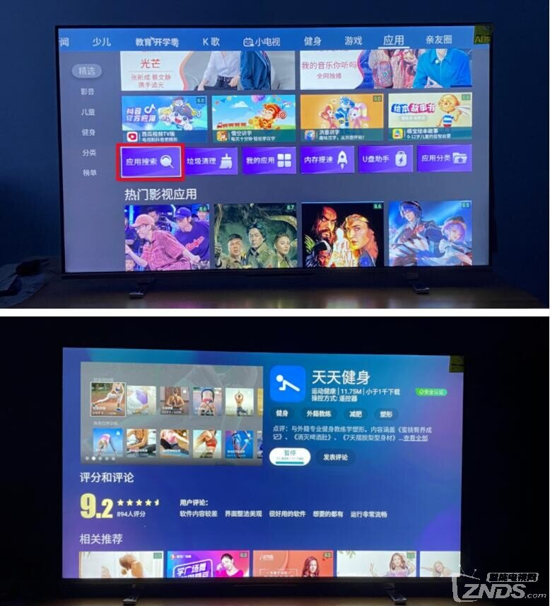
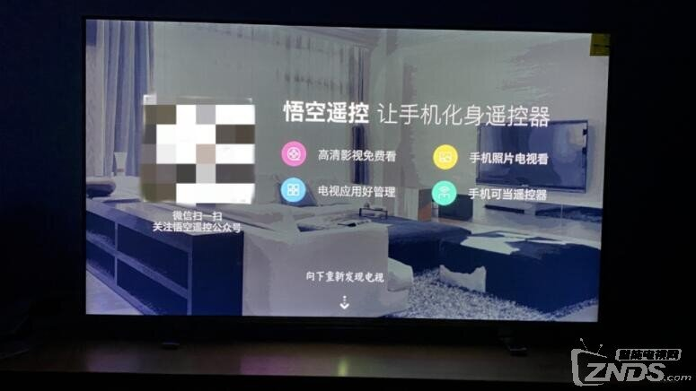
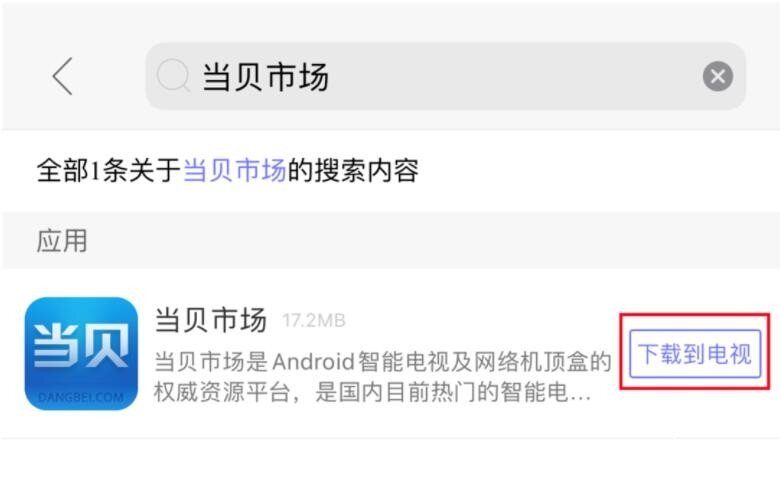
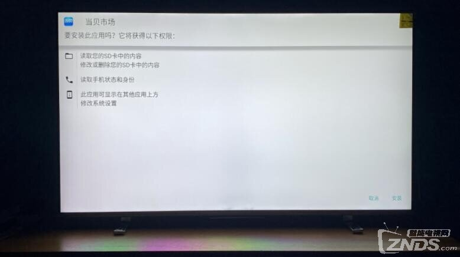
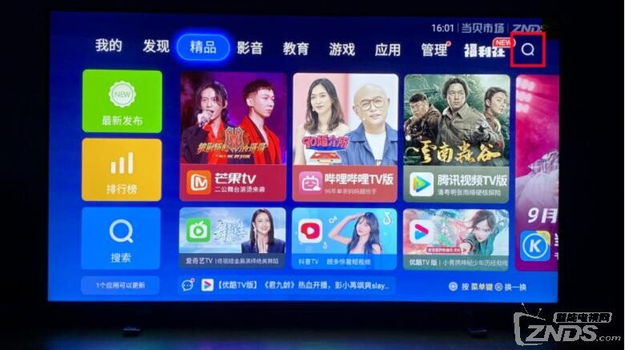

---
hide:
  - toc
---

# 东芝电视如何安装第三方软件 2023东芝电视安装软件教程

相比海信电视和TCL电视，东芝电视仅算的是小众品牌电视，那么东芝电视如何安装第三方软件？2023东芝电视安装软件教程分享给有需要的朋友，按照文中操作即可实现东芝电视安装软件。 **一、东芝电视安装软件教程  ****1、电视端安装天天健身**  东芝电视如何安装第三方软件，首先在应用标签页找到应用搜索，下载好天天健身并打开。

    

**2、电视端安装悟空遥控器**  在手机上安装悟空遥控器。保持手机和电视在同一WiFi下，打开悟空遥控器，连接上电视，会推送TV版悟空遥控器安装包到电视端，选择安装。安装完成后，打开TV版悟空遥控器。

  

**3、安装当贝市场**  在手机端悟空遥控搜索当贝市场，选择下载到电视   

电视端会自动开始下载当贝市场，等待下载完后选择安装即可   

在东芝电视上安装好当贝市场后，就可以在东芝电视随意下载第三方软件了，不用再烦恼找不到好用的电视软件了。K歌、追剧、看电影这些软件在当贝市场里都可以下载到。 三、当贝市场安装好之后，就可以随意在里面安装你需要的第三方点播、游戏、工具等应用，例如：哈趣影视、当贝酷狗音乐、当贝投屏等    
