---
hide:
  - toc

---

 

[海信](/)电视系统是基于安卓平台开发的，因此海信能支持第三方软件下载，因此海信电视可轻松扩展第三方应用。那么海信电视该如何安装第三方软件呢？下面就以当贝市场为例子，和大家分享2022海信电视安装第三方软件最新方法。  **海信电视安装第三方软件2023最新教程分享**

  **方法一：使用【Hi投屏】安装**  

01、先给手机安装当贝市场，点击：**安装官网前往下载**

  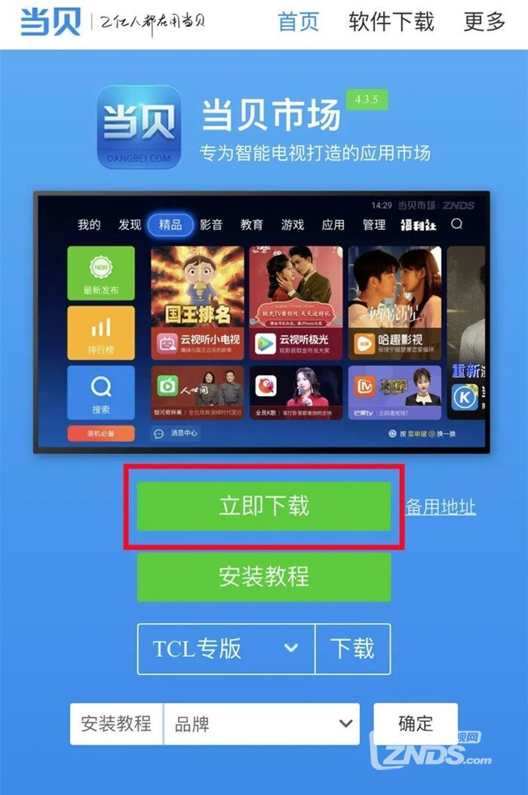 

02、在手机应用商店搜索下载【聚好看】

  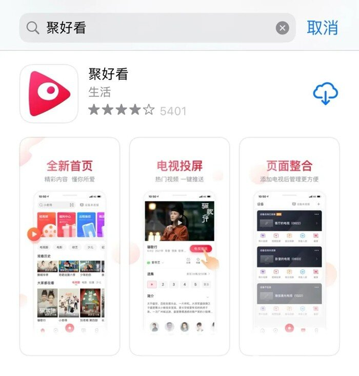 

03、然后在海信电视进入【应用】页面，找到【我的应用】后打开  
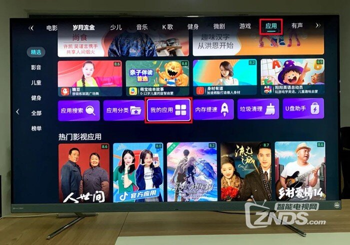 

04、在我的应用中，选择【Hi投屏】点击打开，这里需要注意：Hi投屏版本需要在4.0及其以上才可以 
 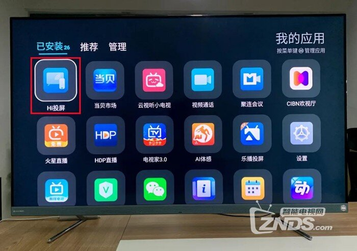 

05、在Hi投屏应用中，点击【文件投屏】进入功能页面，再次点击【文件投屏】进入设备输入界面  
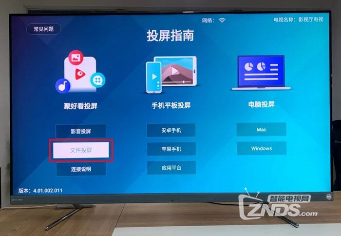 
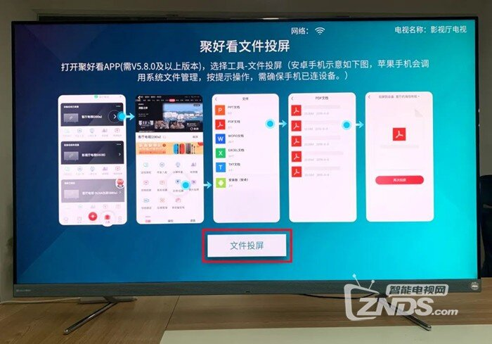 

06、需确认手机和电视处于同一网络下，手机打开聚好看，找到下方【工具】，再点击设备名  
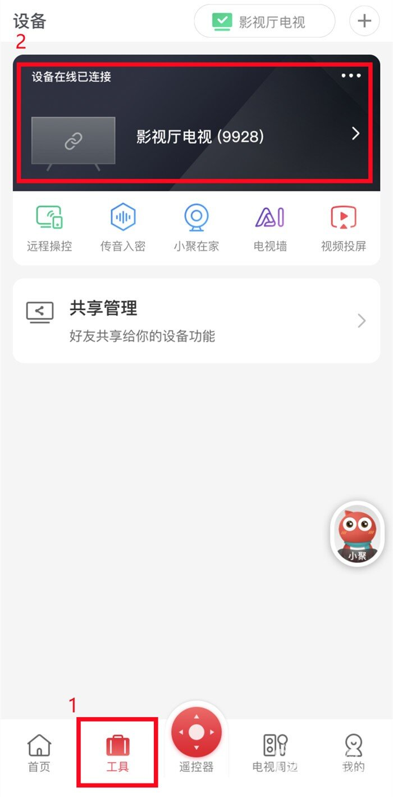 

07、然后点击【文件投屏】，在手机找到当贝市场安装包，点击传送到电视上 
 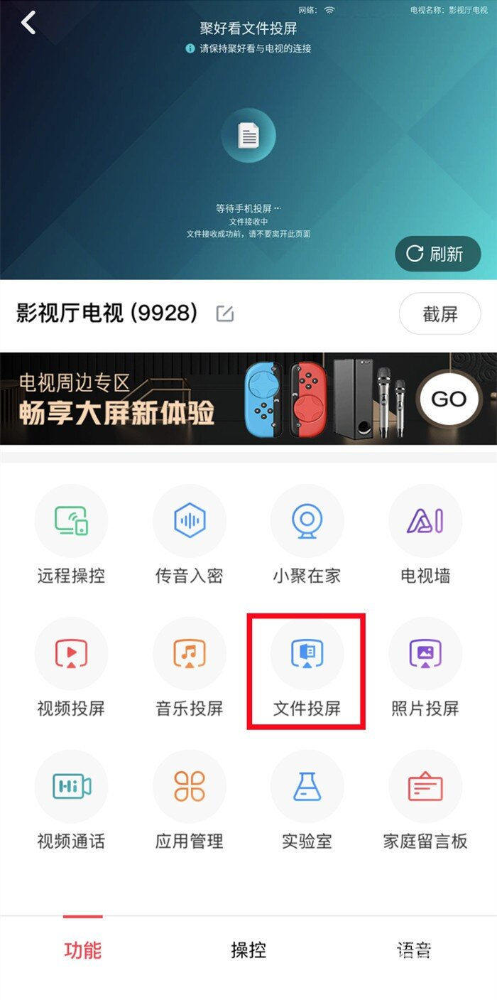 

08、完成推送后，就可在海信电视成功安装当贝市场了

  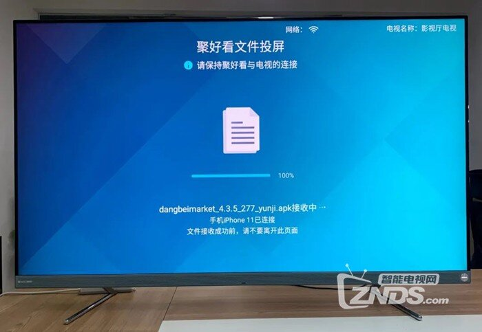  

**方法二：U盘安装**  01、访问当贝市场官网，选择海信版当贝市场将解压的两个apk复制到U盘中  
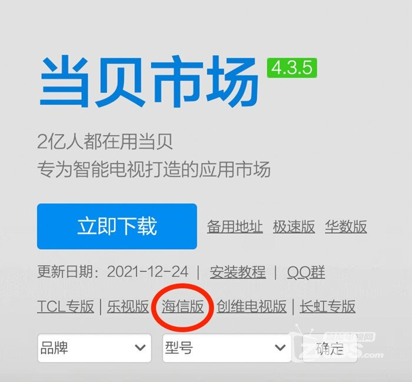 
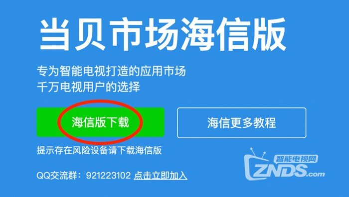 

02、然后打来海信电视，进入【设置】--【通用设置】--【商场模式】，将商场模式开启 
 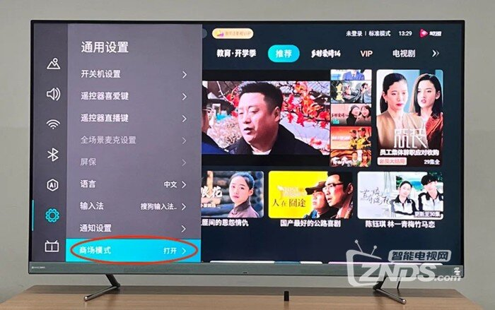 

03、把U盘加入电视，打开【我的】--【我的应用】--【媒体中心】，打开U盘，找到当贝市场安装包  
 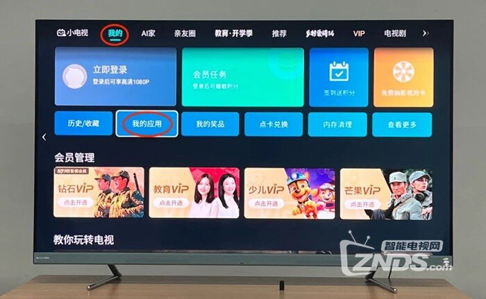 

04、最后点击安装，就能将当贝市场安装到海信电视里面了 
  
 以上就是要和大家分享的海信电视最新两种安装第三方软件通用方法，该方法也可适用于不同型号的海信机型，通过当贝市场即可安装各类应用资源，更多教程也可前往：**海信电视**
