---
hide:
  - toc
---

# 华为智慧屏不用u盘安装当贝市场 华为智慧屏下载当贝市

有许多购买华为智慧屏的不知道如何安装当贝市场，今天我就给大家来分享一下华为智慧屏下载当贝市场的一些方法和教程，其中还有华为智慧屏不用u盘安装当贝市场的教程我也一并分享。

**一、 华为智慧屏下载当贝市场**

目前，华为智慧屏安装当贝市场有三种方法：

> **方法一：通过智慧屏APP免U盘安装**
>
> **方法二：华为Share免U盘安装**
>
> **方法三：U盘安装**

**二、华为智慧屏不用u盘安装当贝市场**

**方法一：通过智慧屏APP免U盘安装**

目前仅支持 EMUI 8.0 及以上版本的华为/荣耀手机、平板，或 Android 8.0 及以上版本的非华为/荣耀手机，或HarmonyOS 2及以上版本华为手机。

**1、安装智慧屏APP**

复制以下链接至浏览器打开，下载【华为智慧屏APP】，根据提示安装好华为智慧屏APP。

华为智慧屏不用u盘安装当贝市场

**2、下载当贝市场安装包**

手机浏览器搜索当贝市场，进入官网下载当贝市场安装包。下载完成后不用安装。

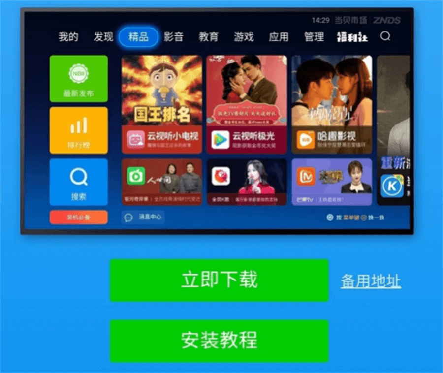

华为智慧屏不用u盘安装当贝市场

**3、安装当贝市场**手机和电视连接同一WiFi，在华为智慧屏APP和华为智慧屏登录同一账号。在华为智慧屏APP首页下滑，找到【华为智慧屏应用】点击进入，再点击右上角+号，找到当贝市场，选择【安装至华为智慧屏】。

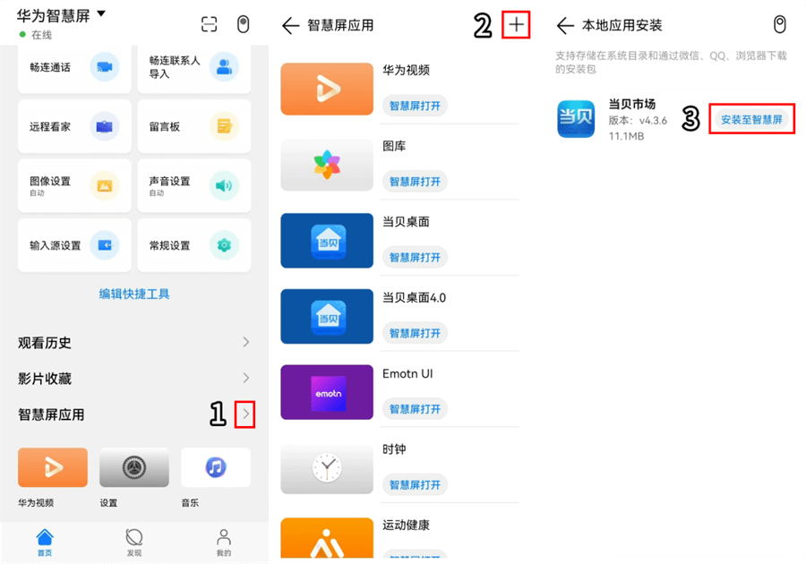

华为智慧屏不用u盘安装当贝市场

**方法二：华为Share免U盘安装**

仅华为/荣耀手机

**1、智慧屏开启华为分享**
HarmonyOS 2.0在首页点击右上角的齿轮，**在设置 > 网络与连接 > 更多设置 > 华为分享**，开启华为分享开关。

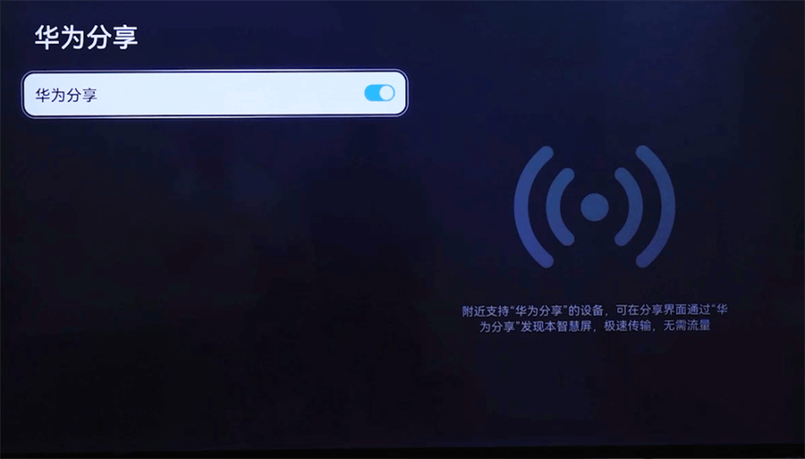

华为智慧屏不用u盘安装当贝市场

HarmonyOS 1.0在首页点击右上角的齿轮，**选择通用 > Huawei Share，开启Huawei Share开关**。

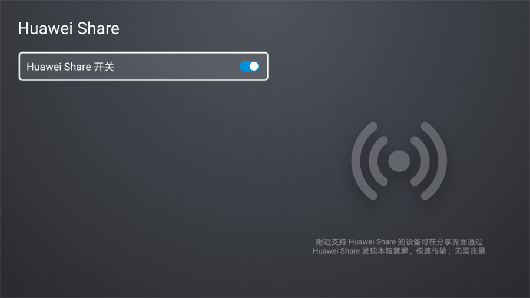

华为智慧屏不用u盘安装当贝市场

**2、手机端开启华为分享**
从手机状态栏向下滑出控制中心，点击华为分享。

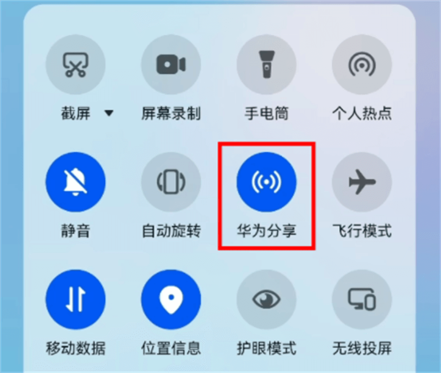

华为智慧屏不用u盘安装当贝市场

**3、手机下载当贝市场安装包**

手机浏览器搜索当贝市场，进入官网下载当贝市场安装包。

下载完成后不用安装。在手机浏览器的下载项里找到当贝市场安装包。

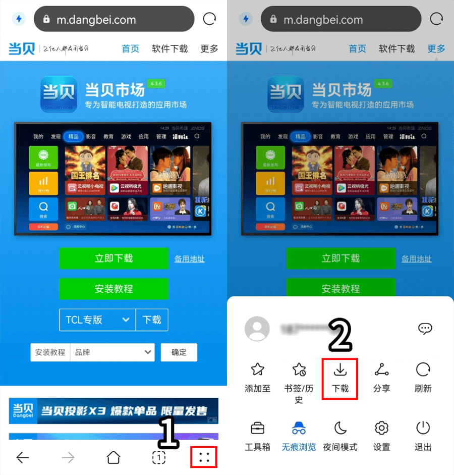

华为智慧屏不用u盘安装当贝市场

长按安装包，点击右下角的更多，选择分享至华为智慧屏。

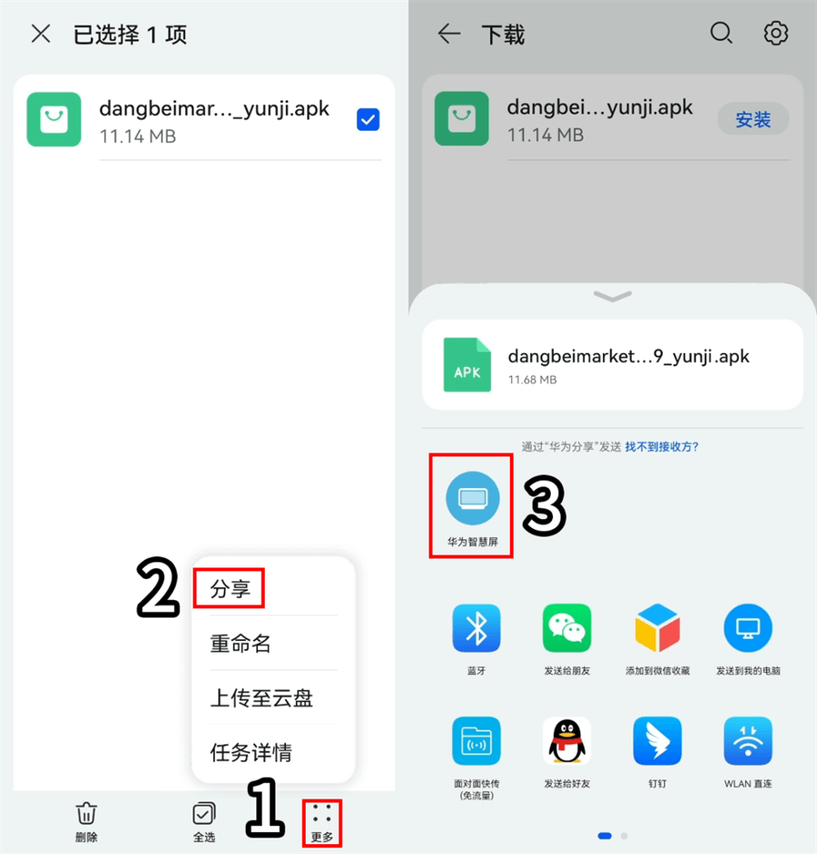

华为智慧屏不用u盘安装当贝市场

在电视端的右上角会提示接收文件，按菜单键进入。

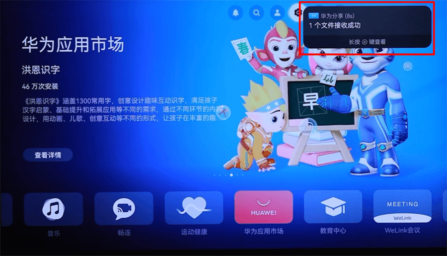

华为智慧屏不用u盘安装当贝市场

点击当贝市场安装包安装即可。

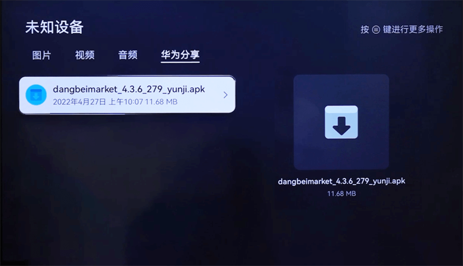

华为智慧屏不用u盘安装当贝市场

**

三、华为智慧屏u盘安装当贝市场****

**

**方法一：U盘安装**

1、在下方直接下载当贝市场apk文件，将当贝市场下载并拷贝到U盘中；

dangbeimarket.apk*(11.35 MB, 下载次数: 29)*

2、将U盘插入智慧屏，会弹窗提示【USB存储设备已接入】。点击【进入】打开U盘。

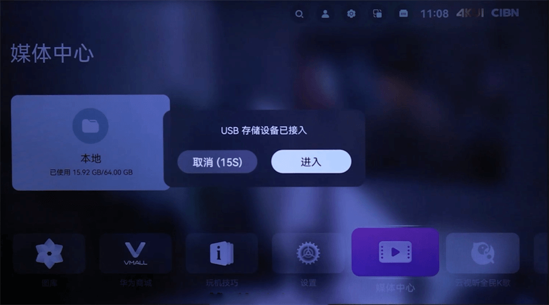

华为智慧屏不用u盘安装当贝市场

切换到“文件”标签页，找到当贝市场安装包，点击安装。

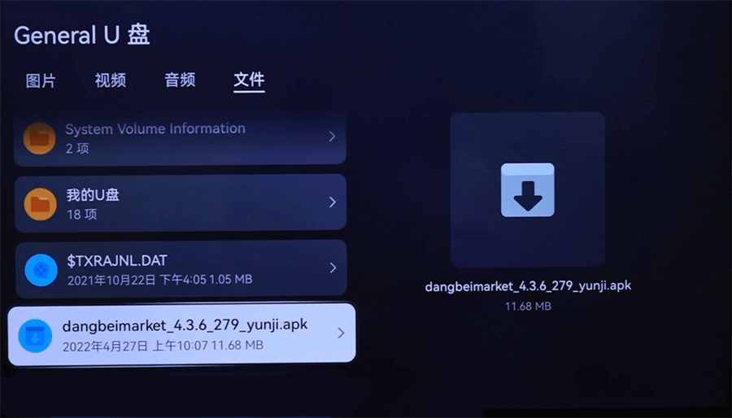

华为智慧屏不用u盘安装当贝市场

当贝市场安装好之后，就可以随意在华为/荣耀智慧屏里面安装你需要的第三方点播、游戏、工具等应用，例如：哈趣影视、当贝酷狗音乐、当贝投屏等

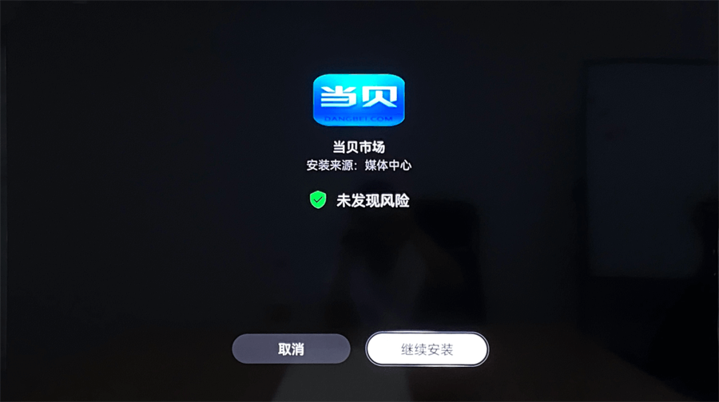

华为智慧屏不用u盘安装当贝市场

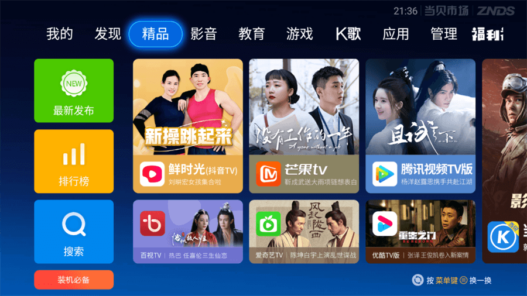

华为智慧屏不用u盘安装当贝市场

以上就是我对“华为智慧屏不用u盘安装当贝市场 华为智慧屏下载当贝市场”内容的分享

