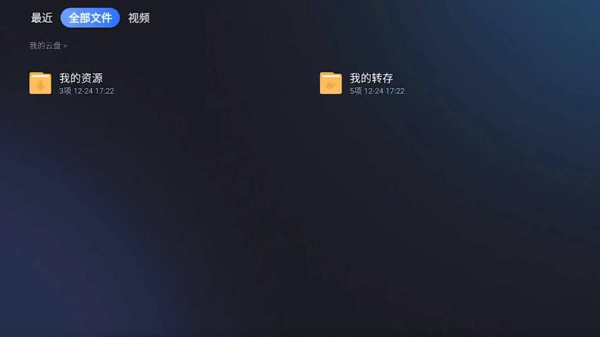

---
hide:
  - toc

---

 

# 不用U盘怎么在电视上安装软件 2024最全电视安装软件方法

**各品牌电视安装详细教程**

[小米](/jiaocheng/xiaomi)
[华为](/jiaocheng/huawei)
[海信](/jiaocheng/haixin)
[康佳](/jiaocheng/kangjia)
[创维](/jiaocheng/kukai)
[酷开](/jiaocheng/kukai)
[三星](/jiaocheng/sanxin)
[索尼](/jiaocheng/soni)
[东芝](/jiaocheng/dongzhi)

在智能电视的使用过程中，我们经常会遇到想要安装新的软件或应用程序的需求。传统的安装方式通常需要使用U盘等外部存储设备来传输安装文件，但是有时我们可能并没有U盘或者希望找到更便捷的安装方法。那么不用U盘怎么在电视上安装软件？2024最全电视安装软件方法汇总来啦！

**一、各品牌自带APP远程推送**

例如：海信电视的聚好看、小米电视的小米电视助手、华为智慧屏的智慧屏、OPPO电视的OPPO电视助手、康佳电视的易互动、暴风电视的风行助手，这些电视品牌都可以通过远程推送安装软件。

**二、远程推送通用办法**

**1、方法一：当贝市场远程推送
****
**电视上已安装当贝市场的当贝市场中，找到“远程推送”，手机扫码或者登录网页即可推送软件到电视。

**2、方法二：甲壳虫adb助手安装**
**
**电视上打开ADB调试——手机安装“甲壳虫adb助手”——保持手机和电视在同一WiFi下——输入电视的IP地址——连接成功后找到要安装的APK文件——点击文件传送就可以安装了。

**3、方法三：微信小程序安装**
**
**例如：海信电视的聚好看、长虹电视的超级大屏、创维电视的电视派、当贝OS的局域网遥控、乐视电视的乐视电视遥控器，这些微信小程序不仅仅是遥控器大部分都支持软件推送功能。

**4、方法四：小白文件管理器
**
在当贝市场中安装并打开小白文件管理器——找到多屏互动——打开快速传输——手机或者电脑输入网页地址就可以进行推送了。

**5、方法五：悟空遥控器
**
在手机上下载“悟空遥控器”——下载完成后打开——点击连接后会自动在电视上安装——然后找到应用中心——点击本地APK应用推送——就会自动推送软件到电视上了

**6、方法六：ES文件浏览器
**
点击ES文件浏览器——找到网络——点击网盘——登录你的网盘——找到网盘内想要安装的APK文件——点击安装就可以了

**7、方法七：当贝桌面**
**
**在当贝市场中下载当贝桌面并打开——遥控器按上键——打开快传界面——扫码或者浏览器登录就可以推送软件安装了

**8、方法八：快传助手
**
在当贝市场中下载快传助手并打开——在浏览器中输入网址或手机直接扫码——就可以推送软件到电视上了

**9、方法九：当贝助手**
**
**在当贝市场中下载当贝助手并打开——点击文件快传——手机或者电脑登录网址——点击APK格式安装包进行推送就好了

**10、方法十：迅雷云盘
**
在当贝市场中下载迅雷云盘——打开迅雷云盘——找到你转存的APK文件——点击下载就可以安装了

