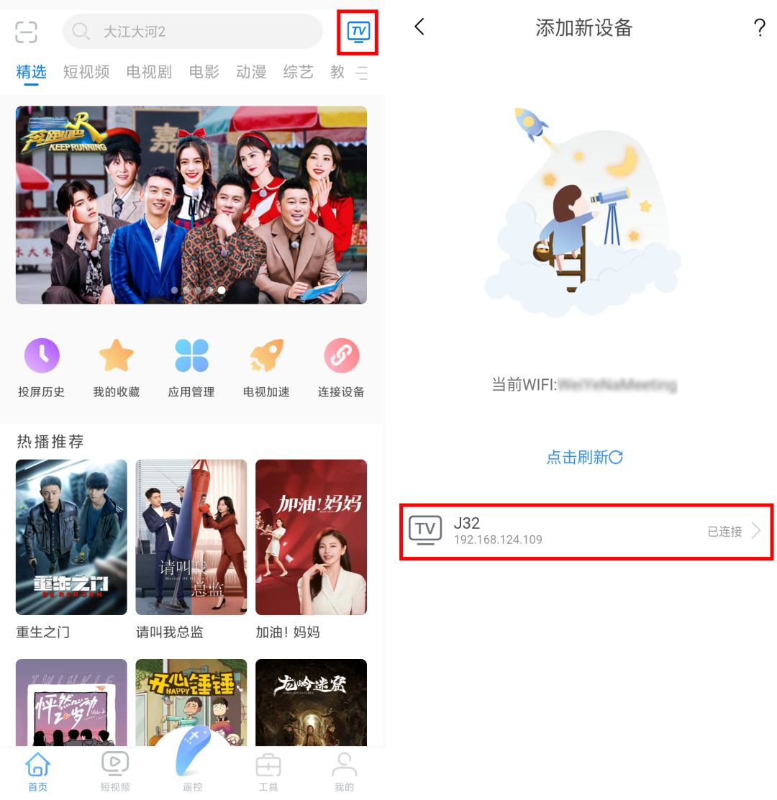
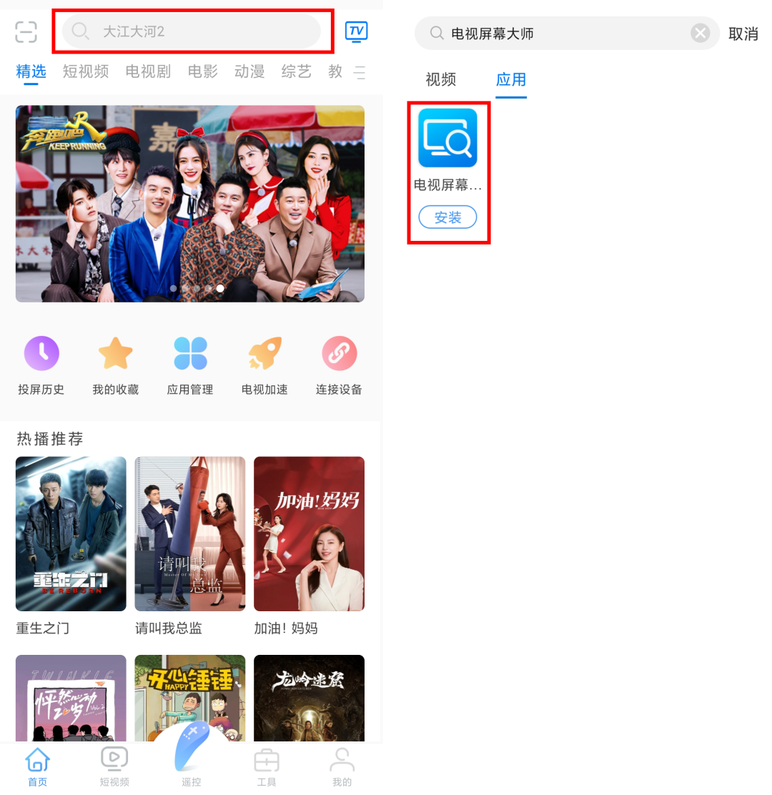
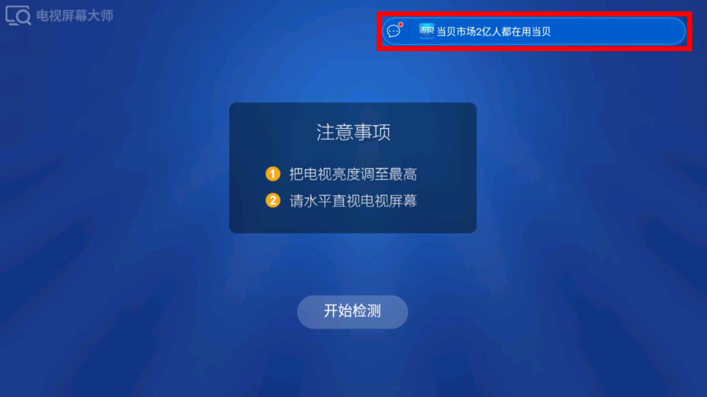
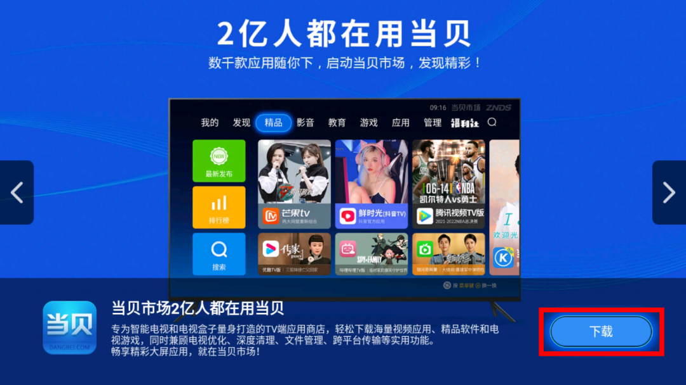
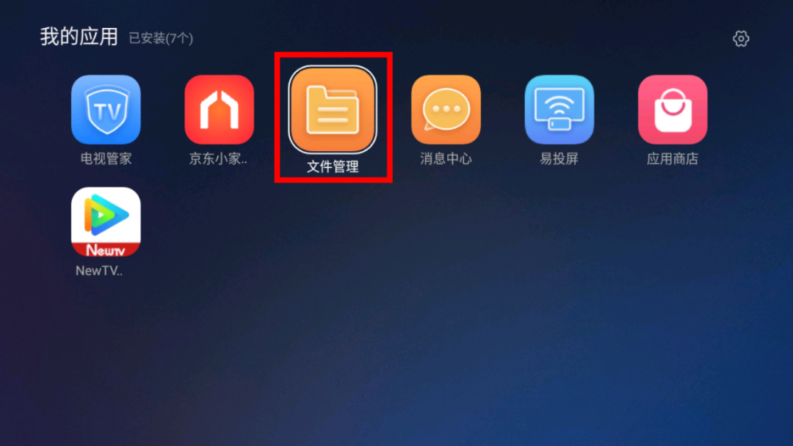
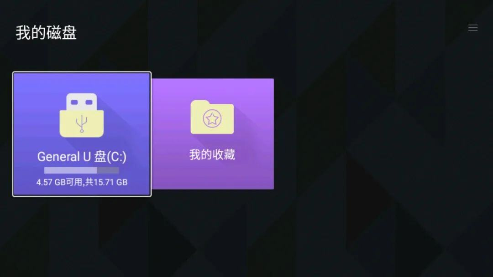
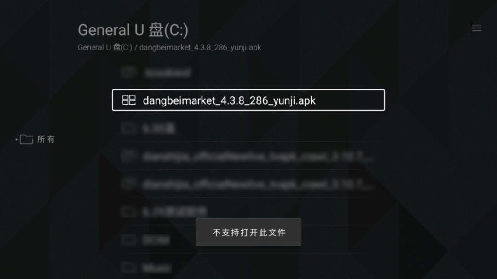
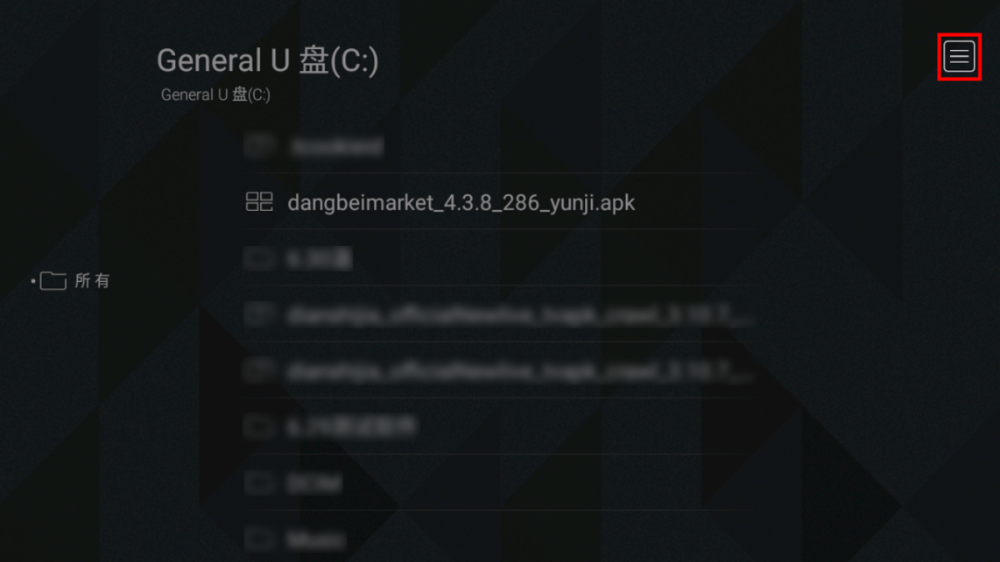
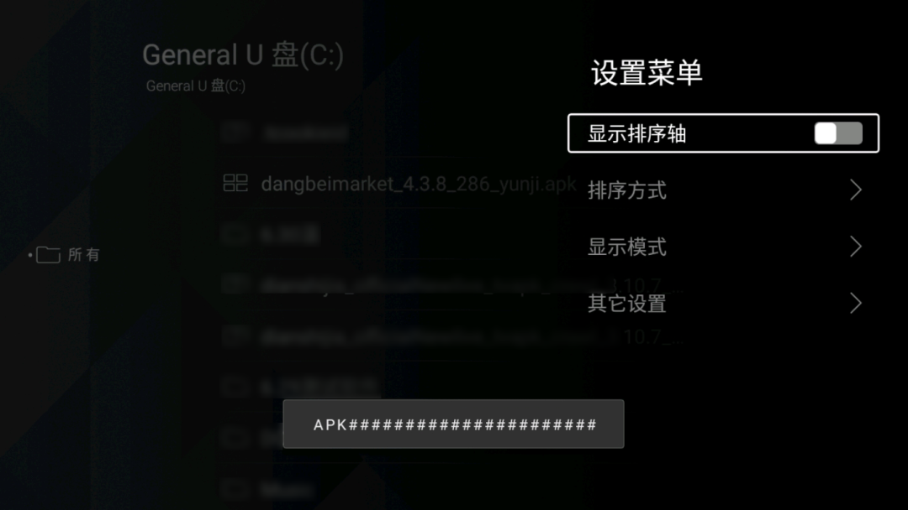
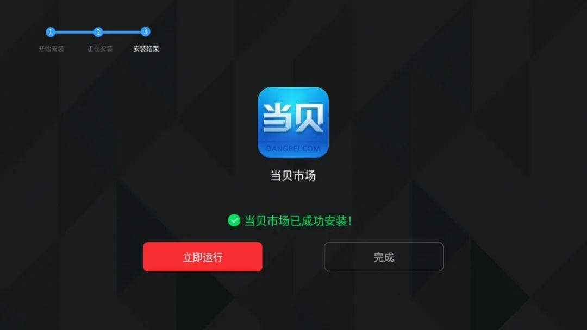

---
hide:
  - toc
---

## 康佳电视怎么安装apk？2023康佳电视安装第三方软件教程

最近不少人问我康佳电视如何安装第三方软件，今天就给大家分享一下康佳电视怎么安装apk？做个2023康佳电视安装第三方软件教程分享。

**一、康佳电视怎么安装apk？**

**结论是，康佳电视可以通过****U盘安装和远程安装的方法来安装apk文件**，具体的方法可以看下方。

**二、2023康佳电视安装第三方软件教程**

**方法一：免U盘安装**

**1.手机安装【易互动】APP**

在手机自带应用商店里下载【易互动】APP。也可以复制下方链接至浏览器打开，下载该APP

http://nontv.kkapp.com/KKINTEF/KKMOBILE/screeninteract/index-8.0.html

**2.连接康佳电视**

手机和电视连接同一网络。手机打开易互动，点击右上角的TV图标，找到要连接的康佳电视进行连接。

**3.安装电视屏幕大师**

在易互动里搜索【电视屏幕大师】，搜索结果页切换至【应用】，选择【安装】电视屏幕大师，等待电视完成【电视屏幕大师】的安装。

**4.安装当贝市场**

打开【电视屏幕大师】，点击右上角的消息框。选择下载当贝市场，并进行安装。

**方法二：U盘安装**

**1.下载当贝市场安装包**

直接下载当贝市场的安装包，将当贝市场下载并拷贝到U盘中。

dangbeimarket_4.4.1_290_znds.apk*(10.36 MB, 下载次数: 34)*

**2.解除U盘安装限制**

将U盘插到电视的USB接口。在【我的应用】里找到【文件管理】，

选择打开General U盘，

此时可以看到当贝市场的安装包，但直接点击进行安装，会提示【不支持打开此文件】。

点击右上角的三条杠，展开该设置菜单。

遥控器连续按五下菜单键，会弹窗提示【APK#####】。此时，U盘安装的限制已被解除。

**3.安装当贝市场**

重新找到当贝市场的安装包，点击即可进行安装，安装完成后即可在康佳电视中下载第三方软件了。

以上就是我对“康佳电视怎么安装apk？2023康佳电视安装第三方软件教程”的内容分享

