---
hide:
  - toc
---

 

# 创维酷开怎么安装apk？2023创维酷开电视安装第三方软件教程

最近不少人问我创维酷开电视安装第三方软件的问题，今天就给大家分享一下看看创维酷开怎么安装apk？做个2023创维酷开电视安装第三方软件教程。

**一、2023创维酷开电视安装第三方软件教程**

**第一步，下载当贝市场创维版安装包**

1、浏览器访问https://www.dangbei.com/chuangwei.html，进入当贝市场创维版下载页面，点击【创维专用当贝市场下载】，下载当贝市场创维电视版。

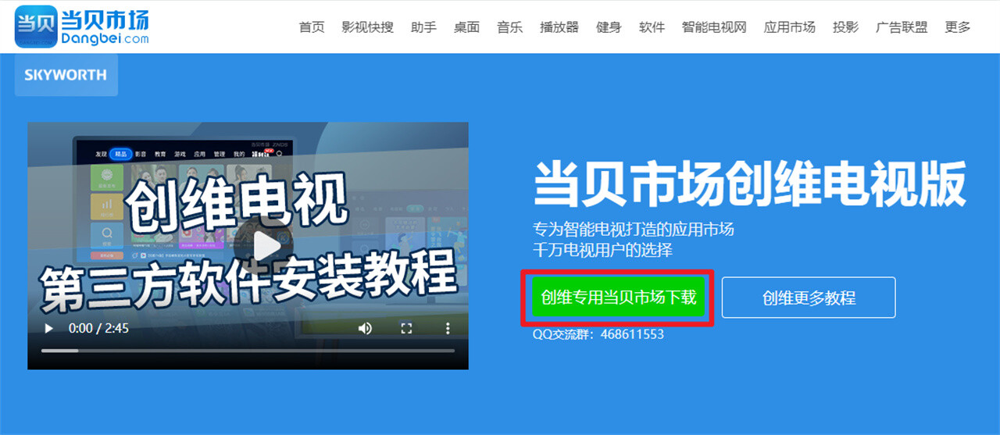

2、下载完成后将安装包复制至U盘。

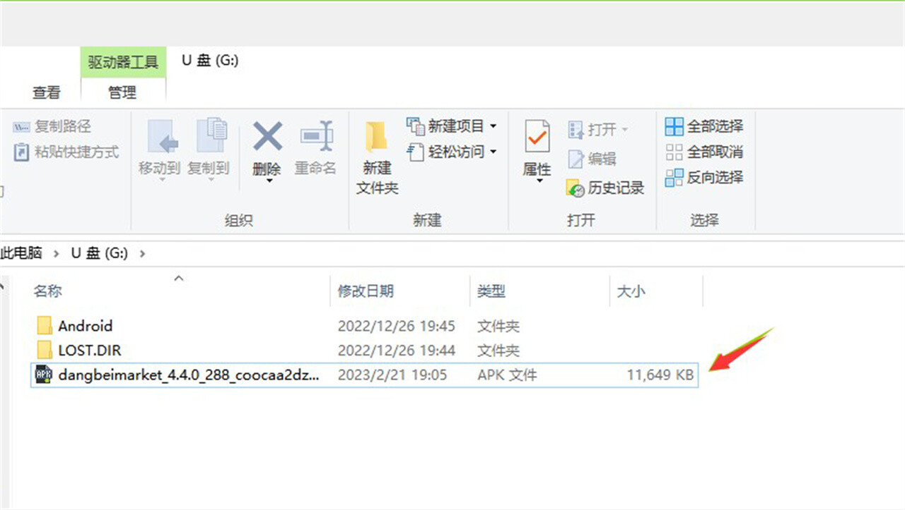

**第二步，允许安装未知来源应用**

3、在电视主页的左上角找到人像标志，点击进入后，页面下拉找到【设置】。

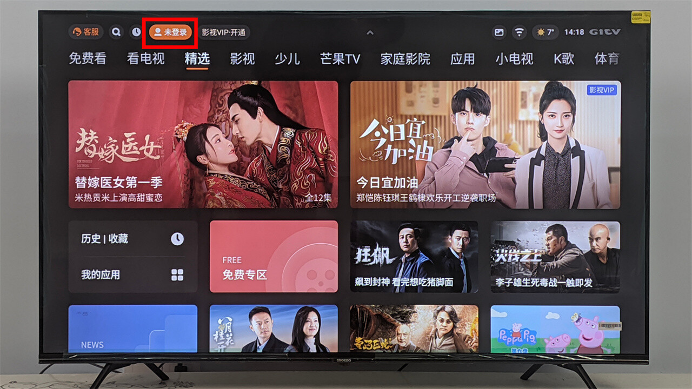

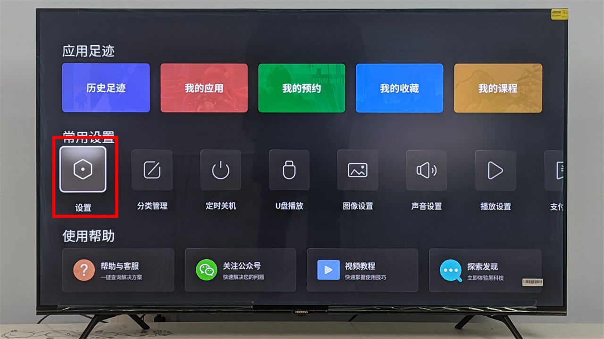

4、或在主页按菜单键，在便捷面板中找到【设置】。

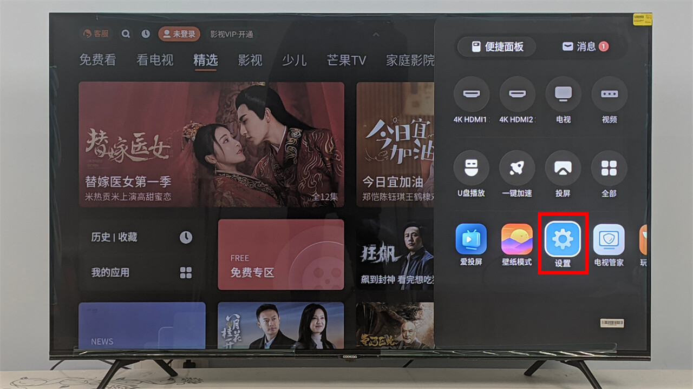

5、在【设置】找到【应用管理】，选择允许安装未知来源应用。

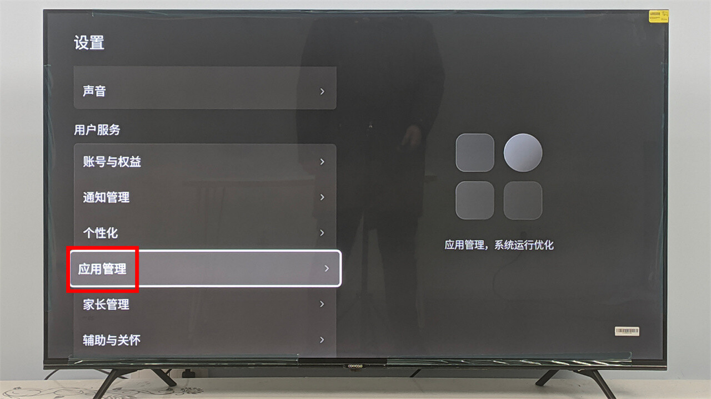

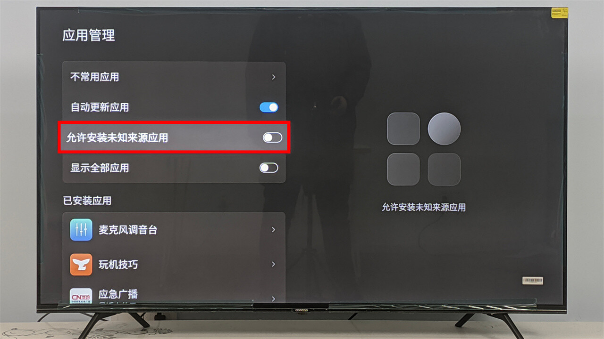

6、在弹出的提示中选择【同意并开启】。

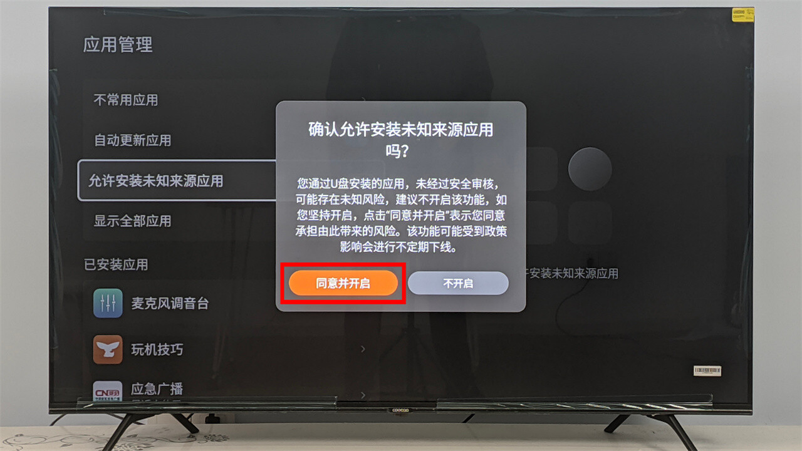

**第三步，安装当贝市场创维版**

7、将U盘插到电视上，会提示检测到外接存储设备，选择【全部】打开U盘。或在应用页内找到【我的应用】-【U盘播放】打开U盘。

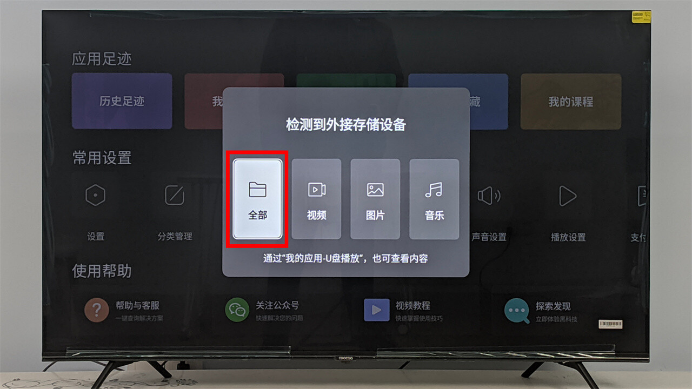

8、在U盘中找到当贝市场创维版的安装包，点击进行安装。会弹窗提示是否继续安装，选择【确定】。

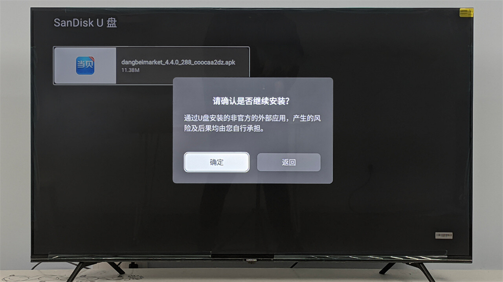

9、等待提示“应用安装成功”后，返回主页，在应用页内找到【我的应用】就可以看到当贝市场coocaa，也就是当贝市场创维版已经安装好了。

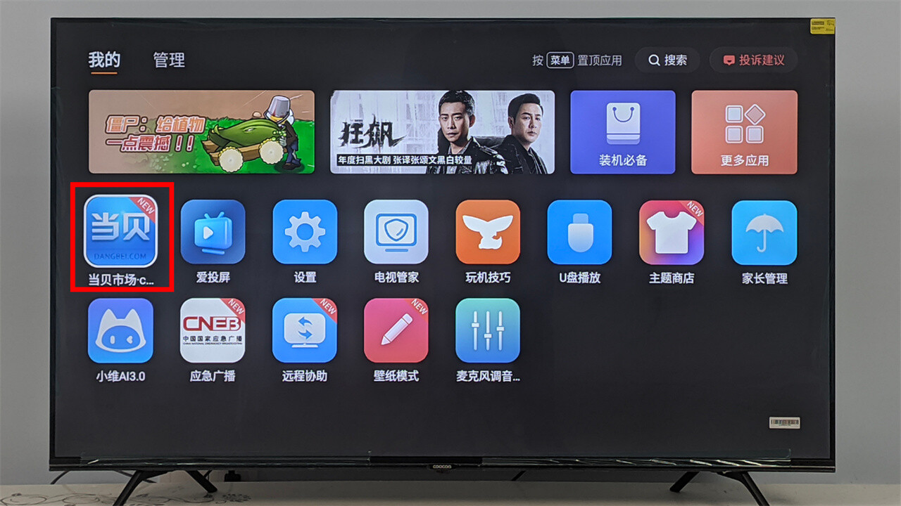

当贝市场创维版安装好之后，就可以随意在里面安装你需要的第三方点播、游戏、工具等应用。以上就是我对“创维酷开怎么安装apk？2023创维酷开电视安装第三方软件教程”的内容分享，**如果你在创维电视购机、玩机的时候有任何问题，可以加入QQ群：1128500569，我们共同交流。**

