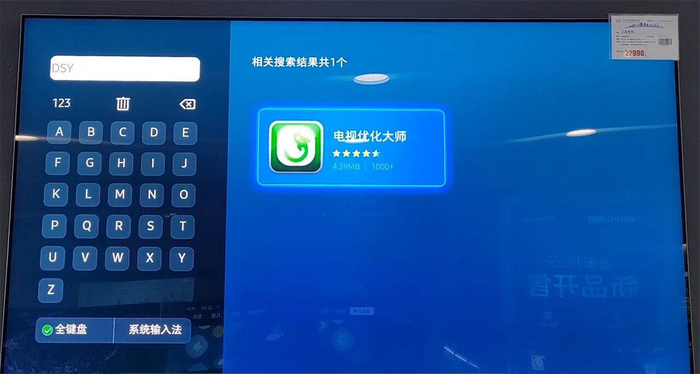
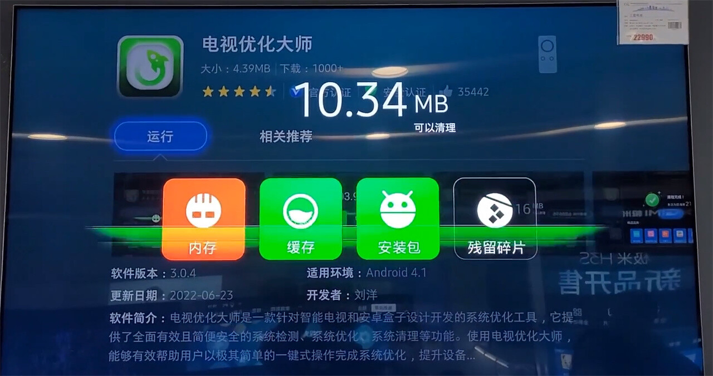
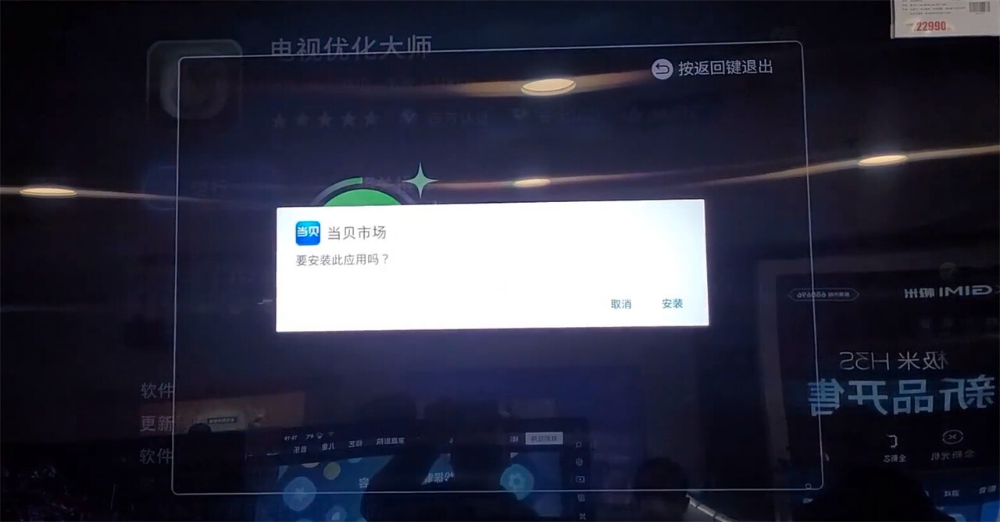
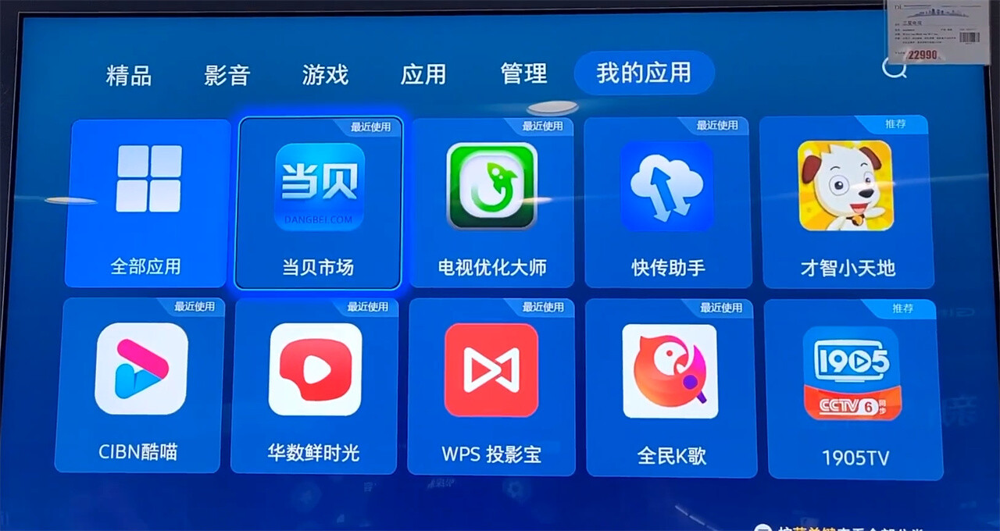
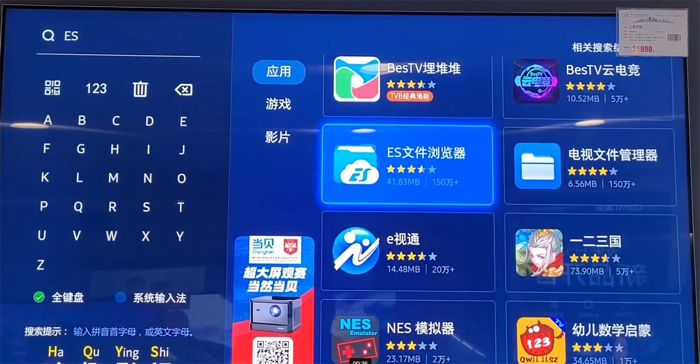
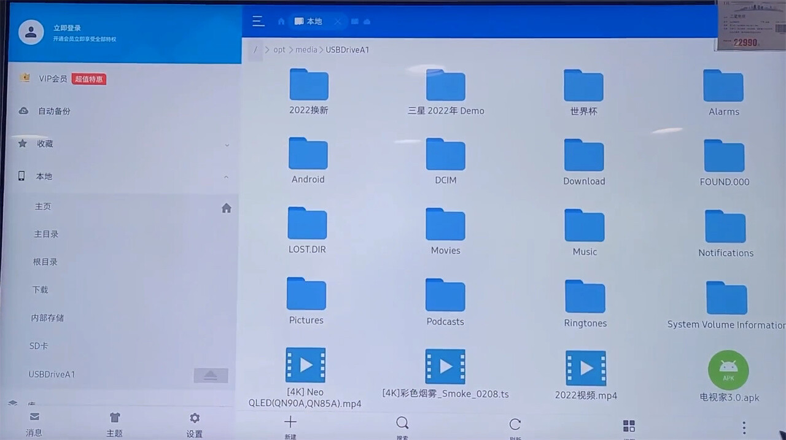

---
hide:
  - toc
---

# 三星C系列如何安装APK？2023三星电视安装第三方软件教程

最近不少人问我三星电视如何安装软件的问题，刚好我找到了一个2023最新的三星安装APK教程，在这里给大家分享一下看看三星C系列如何安装APK？以及2023三星电视安装第三方软件教程。

**一、2023三星电视安装第三方软件教程**

1.打开三星电视，进入三星电视应用商店，搜索【DSYHDS】（电视优化大师），根据三星电视的提示进行安装；

2.安装完电视优化大师后，点击运行，运行结束后不要退出；

3.依次点击三星电视的遥控器【左右左右下键】，会弹出【当贝市场】，然后根据提示一步步进行安装；

4.安装完成后退出该界面，然后进入【我的应用】，进入【当贝市场】；

5.进入【当贝市场】后搜索【ESWJLLQ】（ES文件浏览器），根据提示一步步下载；

6.安装完ES文件浏览器后，找到【本地】，找到SD卡或者USB，点击打开就可以看到我们的U盘；

7.在自己的U盘里找到自己想要安装的apk文件，就可以安装了。

**二、三星C系列如何安装APK？**

我之前写过一个教程，看看三星C系列如果安装第三方软件，有需要的可以看这里：三星C系列安装第三方软件教程。

以上就是我对“三星C系列如何安装APK？2023三星电视安装第三方软件教程”的内容分享

