---
hide:
  - toc
---

# 索尼电视安装当贝市场 2023索尼电视安装第三方软件最新教程

索尼电视系统是基于安卓架构进行开发的，系统相对比较开放，因此是能安装第三方软件的。那么索尼电视要如何才能安装第三方软件呢？下面就以当贝市场为例子，和大家分享2023索尼电视安装当贝市场最新教程。  **索尼电视安装第三方软件最新教程**  01、下载当贝市场到U盘，当贝市场下载地址：**点击此处前往下载**  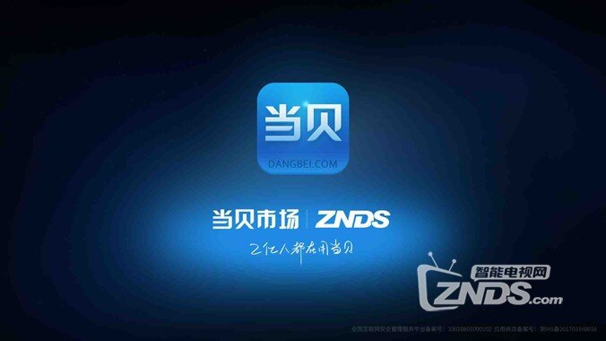 

02、打开索尼电视，在主页面打开“设置”，然后找到【应用】，就能找到“应用助手”，然后清除数据  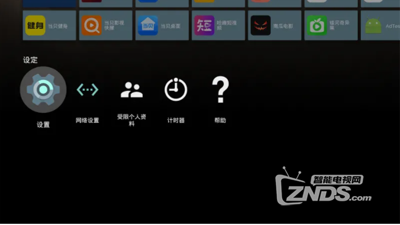 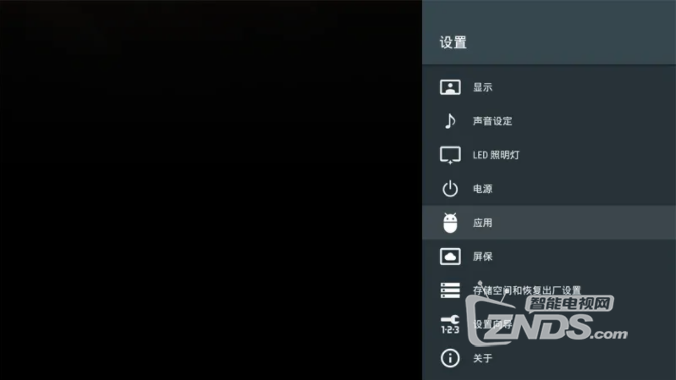 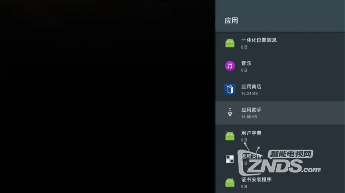 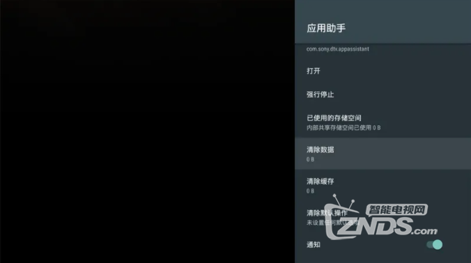

 03、打开索尼电视个人【安全和限制】，将【未知来源】开启 

 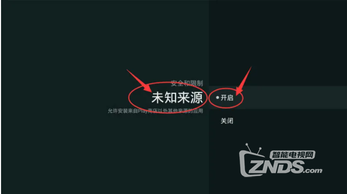 

04、然后将U盘连接索尼电视USB接口，在主页面找到【应用助手】，接着找到当贝市场文件包，打开确认安装即可  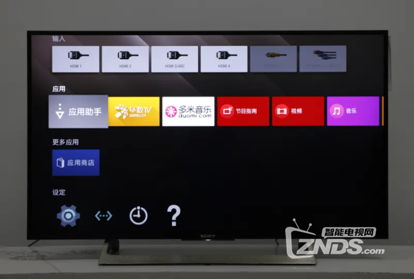 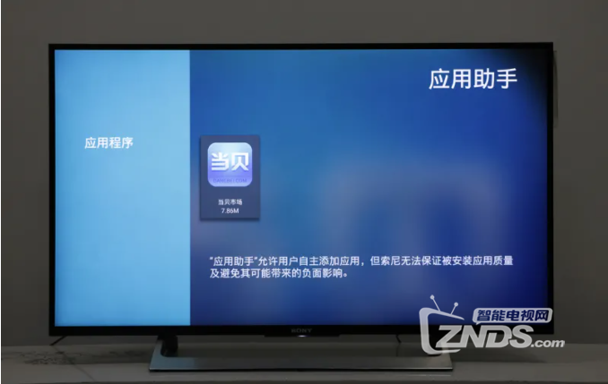 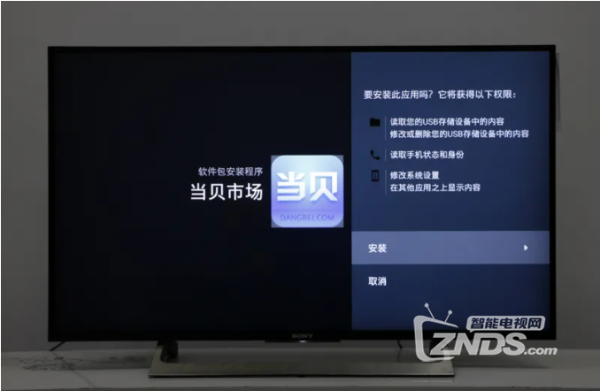 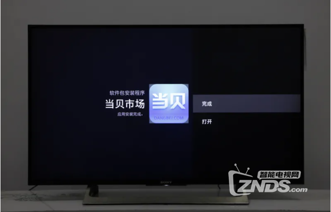 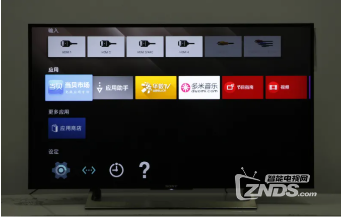

 05、完成安装后，就能通过当贝市场给电视安装不同第三方软件了  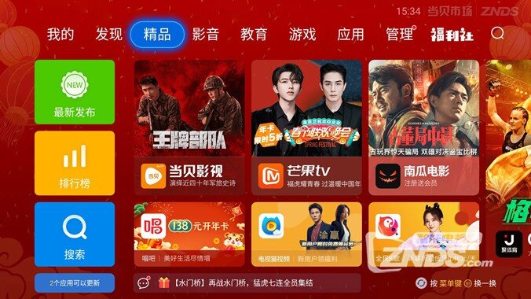   以上就是今天要和大家讨论的索尼电视如何安装第三方软件的最新教程，最关键的就是需将电视【未知来源】设为开启状态即可安装。更多索尼教程也可关注：**索尼电视**  
