---
hide:
  - toc
---

# 2023小米、红米电视安装第三方软件方法汇总

小米电视和红米电视都是采用的MIUI系统，因此崽安装软件的方法上，两个品牌都是可以通用的，那么2023款的小米电视和红米电视怎么安装第三方软件扩展电视内容呢？给大家分享2023小米、红米电视安装第三方软件方法汇总！

> 目前，小米/红米电视安装当贝市场有三种方法
>
> - **方法一：通过小米电视助手安装**
> - **方法二：通过悟空遥控器安装**
> - **方法三：通过U盘安装**

当贝市场安装包：http://down.znds.com/apk/ruanjianyincang/2014/0419/463.html

------

**方法一：通过小米电视助手安装**（该方法仅于安卓手机）

1、手机下载当贝市场安装包

2、手机应用商店下载【小米电视助手】在手机自带的应用商店里安装【小米电视助手】，自带应用商店里没有的，可以直接在百度上搜索下载一个。

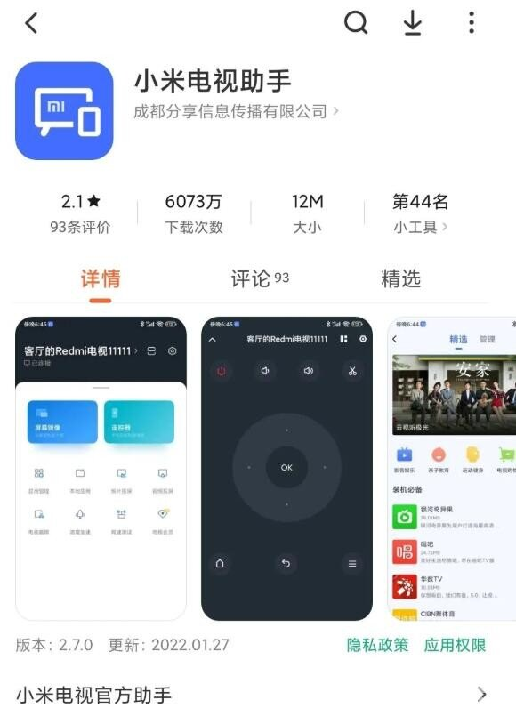

3、远程安装当贝市场保持手机和电视同一WiFi，打开小米电视助手，点击下方的提示连接到电视。会自动搜索同一WiFi下的小米/红米电视。

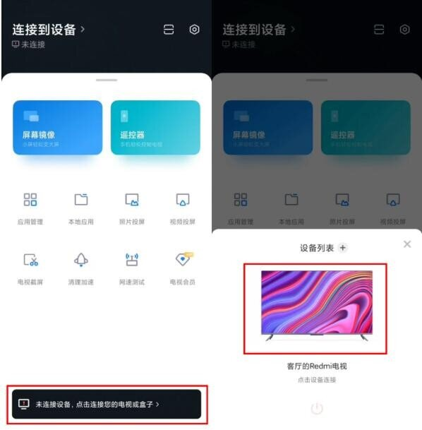

找到设备后，点击要连接的电视，输入在电视上显示的验证码。

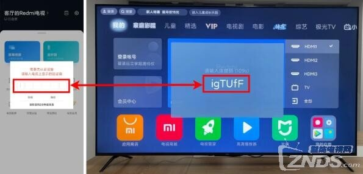

点击【本地应用】后，会显示之前手机浏览器里下载的安装包。选择当贝市场的安装包【安装到电视】，等待手机上出现【在电视打开】的按钮，就是安装成功了。

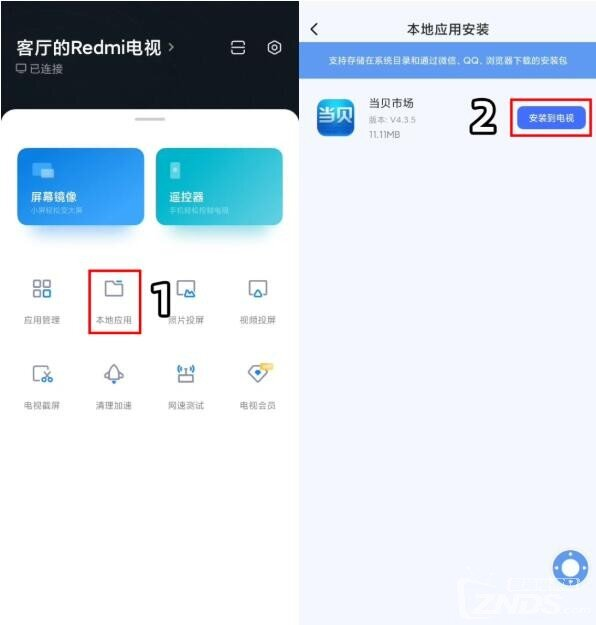

------

**方法二：通过悟空遥控器安装**

1、允许安装未知来源应用在小米/红米电视的【设置】-【账号与安全】里，选择允许安装未知来源的应用。

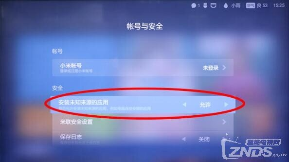

2、手机安装悟空遥控器手机应用商店或浏览器下载安装悟空遥控器。

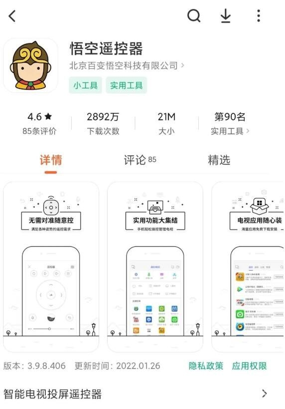

3、连接小米/红米电视手机和电视连接同一WiFi。手机打开悟空遥控器，点击左上角进入设备连接界面，在此界面点击【小米设备】进行连接。（iOS系统需要在电视上下载天天健身或天天瑜伽，并且手机和电视连接时，电视停留在天天健身或天天瑜伽页面）

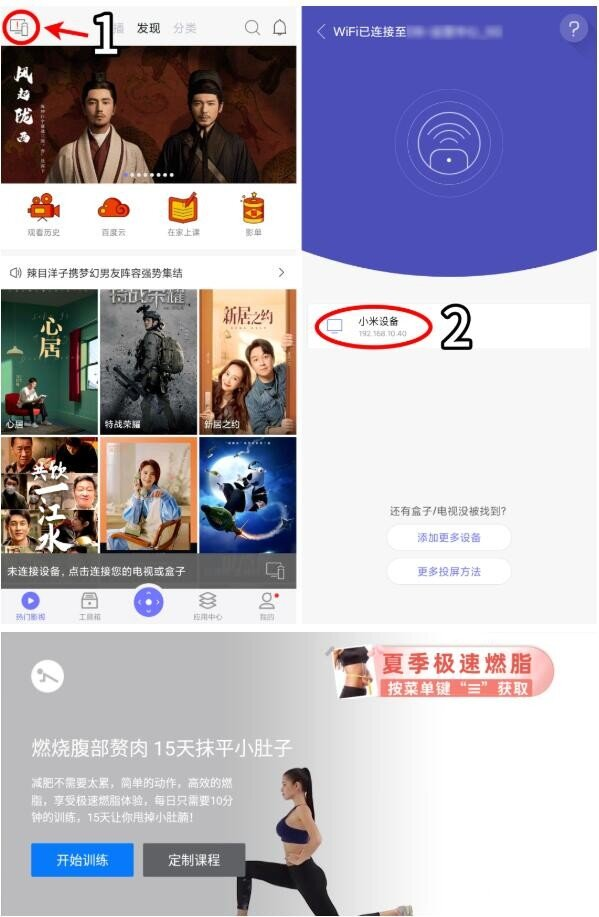

此时电视上会提示【请输入连接码】，手机端悟空遥控器会也会弹窗提示【输入电视上显示的验证码】。正确填写（区分大小写）验证码后，小米/红米电视会开始自动安装悟空遥控器。

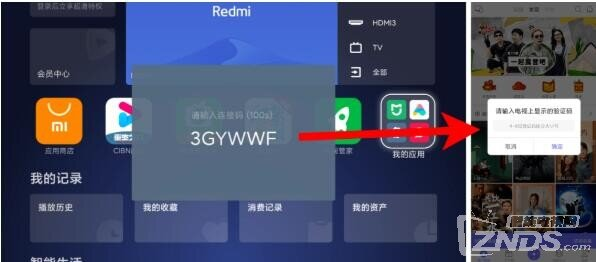

安装完成后，小米电视会自动打开电视端的悟空遥控器。

4、安装当贝市场在手机悟空遥控器上搜索当贝市场，并选择【下载到电视上】。

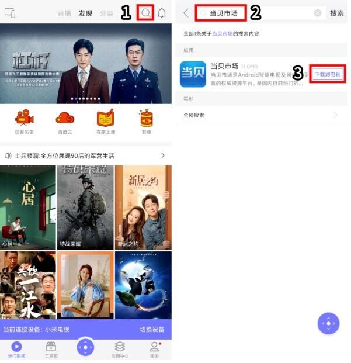

注：「悟空遥控器」最近处于改版中，暂时不能直接搜索应用。可通过以下方法解决。苹果版本无法找到应用中心，需等待后续应用更新或改版结束。安卓手机则可以选择【应用中心】-【最热应用】-【查看更多】-下拉找到当贝市场。

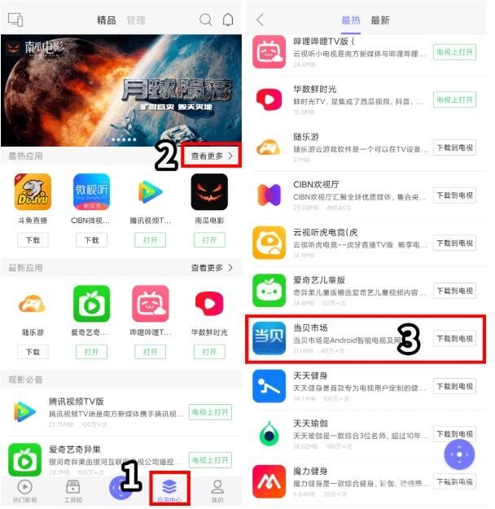

电视端的悟空遥控器会自动下载当贝市场。

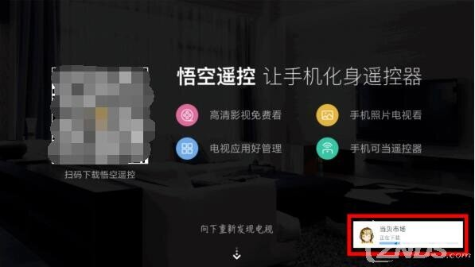

下载完成后，会弹窗提示【可能存在未知风险】。选择【继续安装】即可。

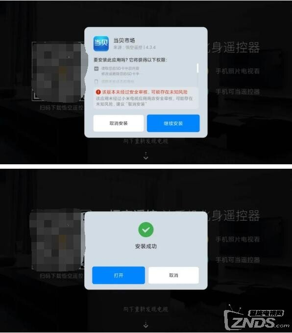

**方法三：通过U盘安装**

1、下载当贝市场安装包下载当贝市场安装包。下载完成后，将安装包复制到U盘。

2、允许安装未知来源应用在小米/红米电视的【设置】-【账号与安全】里，选择允许安装未知来源的应用。

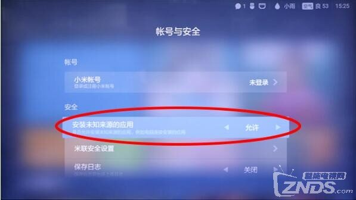

3、安装当贝市场将U盘插到电视上。在弹窗上选择【打开U盘】。

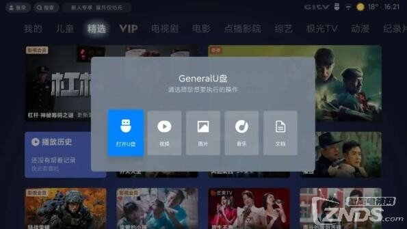

找到当贝市场的安装包，点击安装。

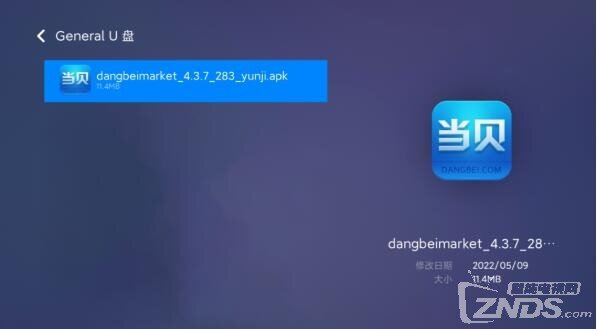

弹窗提示【可能存在未知风险】，选择【继续安装】即可。

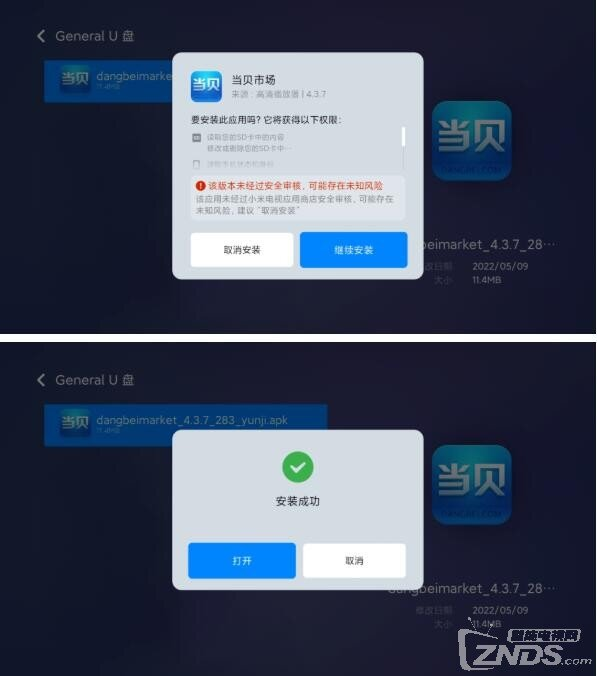

当贝市场安装好之后，就可以随意在里面安装你需要的第三方点播、游戏、工具等应用，例如：哈趣影视、当贝酷狗音乐、当贝投屏等

