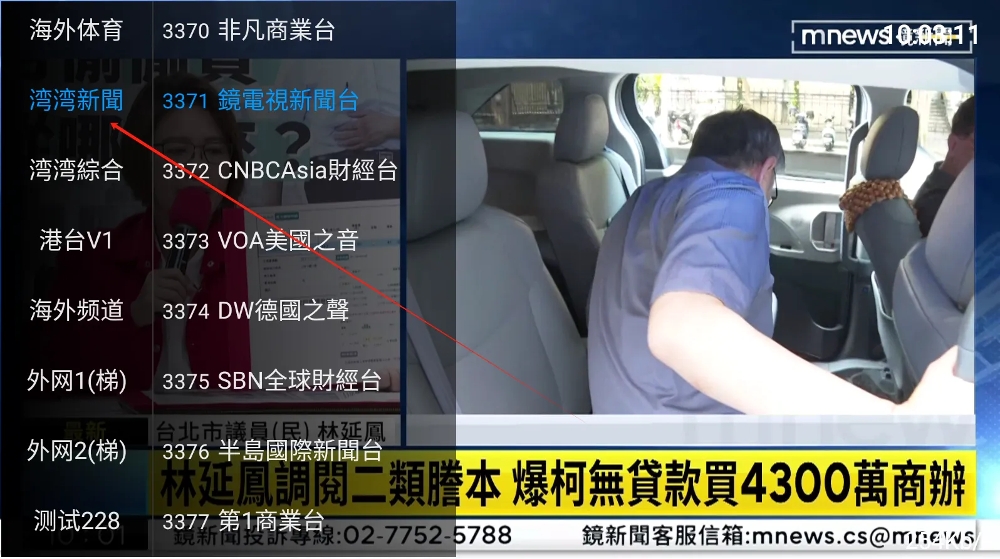

---
hide:
  - toc
---

1. **按返回键可以进入设置页面，里面有多个项目可以调节，可以根据自己的需要开关**
2. **如果你的设备比较新，支持硬件解码。可以在软件里面开启原生解码，节目画质和流畅度会提高很多，默认IJK解码是为了兼容更多的设备！**
3. **软件内置多组源，如果你的网络播放不了当前节目源，会自动跳到下一组或下一台（默认30秒）也可以手动更改，或是按左右键手动选择你最流畅的源。软件会自动记忆！**
4. **后台维护者也会不断增加稳定快速的源，删除不好的源，所以频道数量经常会变化。速度慢卡的节目频道你只要手动按左右键换源，选择最流畅的即可！**
5. **港台vip里面是打赏用户专享，里面有更多节目，需要打赏支持作者后才有！**

