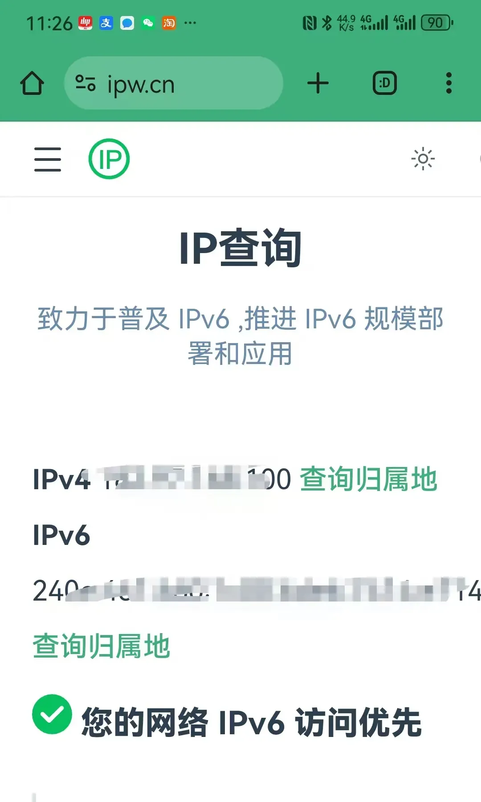

---
hide:
  - toc
---

由于ipv6网络的优势，目前国家也在大力推进ipv6网络，所以大部分源改为ipv6网络优先。在你家网络没有ipv6的情况下链接可能会比较慢，超时后才会切换到ipv4，也可以按遥控的左右键快速切换源。

测试是否有ipv6的方法：手机连上家里的wifi后，打开网站 [https://ipw.cn/](https://ipw.cn/ ) 即可知道。目前电信移动联通都可以免费开通ipv6,拨打客服电话要求开通ipv6就可以了。

移动网络的用户请优先使用移动专区里面的节目，高清、快速、稳定。还可以在设置菜单中屏蔽自己网络不支持的区域，比如移动网络可以屏蔽电信专区，外网专区等等！
有ipv6网络的用户也可以优先使用ipv6专区的节目！

1. **首先，在软件出问题的时候，推荐你可以先下载最新版试试，因为软件一直在优化升级，加入新功能……如果你目前安装的版本能正常使用也可以继续使用。**

2. **安装或升级过程中出现任何问题可以先把老版本删除再安装升级!**

3. **由于安卓版本太多，软件自动升级时如果卡死可以删除老版本，重新在本页下载新版本安装即可。**

4. **提示网络连接失败，那是因为一些原因你的IP被服务器拒绝登入。把你家的光猫断电10秒重启，再次打开软件就好了，或者是等一段时间会自动修复 。**

   

